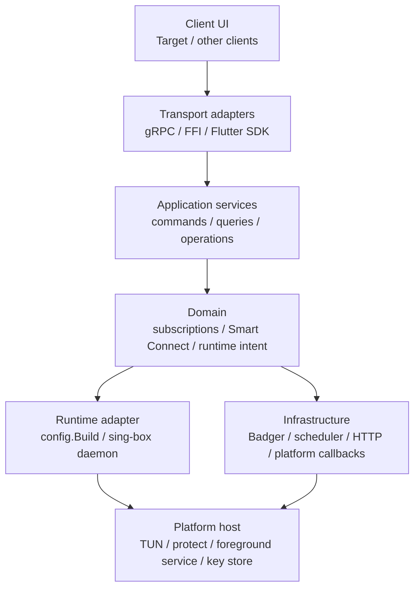
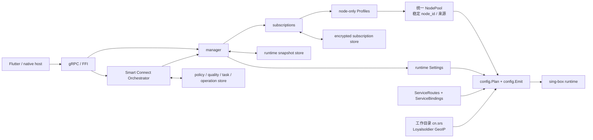
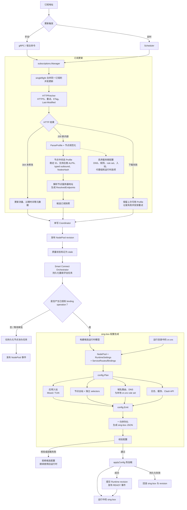

# TargetLib 架构

TargetLib 将订阅管理、Smart Connect 策略与编排、配置生成和 sing-box 生命周期封装在共享的 Go 核心中。
Flutter、FFI 和 gRPC 只负责传递用户意图、平台能力和状态，不承担订阅下载、探测调度、候选评分、
绑定决策或运行时配置构造。该边界保证 UI 被挂起后，核心仍能独立维持代理和后台任务。

## 文档体系

三份文档共同定义架构，发生歧义时按下列所有权解释，不在多处复制同一规则：

| 文档 | 权威范围 | 不重复定义 |
| --- | --- | --- |
| 本文 | 系统分层、模块依赖、部署拓扑、启动恢复和端到端数据流 | Smart Connect 字段细节和具体 RPC wire contract |
| [Smart Connect 目标架构](SMART_CONNECT_ARCHITECTURE.md) | 领域模型、策略、调度器、决策、切换状态机、不变量和验收标准 | 通用订阅解析和协议传输细节 |
| [gRPC 能力总览](GRPC.md) | 当前 RPC、目标意图 API、并发控制、幂等、错误码和兼容策略 | 领域算法和 sing-box 配置生成 |

当前代码事实与目标设计必须明确标注。`现有 v13` 表示已经存在于 proto/实现；`目标` 表示仍待平台宿主或产品客户端完成的迁移方向。

## 分层与依赖方向



依赖只能从外层指向内层接口。proto 类型不得成为领域存储模型；gRPC handler 只做认证、校验、类型转换和应用服务调用。
领域层不能依赖 Flutter、Android Activity 或某个 RPC 是否保持连接。`config` 只消费规范化运行意图，不读取 UI 状态或执行评分。

## 模块职责

| 模块 | 职责 |
| --- | --- |
| `api/TargetLib` | gRPC 协议与传输模型 |
| `subscriptions` | 订阅更新、调度、存储、事件和端点解析 |
| `profile` | 节点中间态与 sing-box 节点解析 |
| `config` | `NodePool + RuntimeSettings + ServiceRoutes` 到 sing-box 配置的唯一生成路径 |
| `manager/smartconnect`（目标） | 策略、持久化调度、探测编排、唯一决策引擎、proposal、绑定状态机和审计 |
| `manager` | 节点池与运行时协调、selector/绑定事务、运行事件和生命周期 |
| `ffi/native`、`flutter` | 平台接入、意图命令、snapshot/event 传输和客户端绑定 |



## 核心边界

- 前端只发送添加、删除、更新、审批、强制绑定和启停等意图级命令，并渲染核心 snapshot。
- Smart Connect 策略、节点偏好、评分、调度任务、proposal 和 binding 只在 TargetLib 中持久化。
- 产品客户端不得构造或替换完整 `RuntimeModel`；该接口迁移后仅用于兼容、诊断和底层测试。
- 原始订阅配置只作为解析输入，运行时只消费节点中间态 `profile.Profile`。
- `profile` 在持久化前统一规范化供应商节点；供应商 ALPN 和已移除的 TLS 字段不会进入节点中间态。
- 服务商提供的 DNS、路由、rule set、入站、selector/urltest 分组和运行时选项不会透传。
- `rule` 路由模式只使用 TargetLib 随运行目录提供的本地 [`cn.srs`](https://github.com/Loyalsoldier/geoip/tree/release/srs)，中国大陆目标 IP 直连，其余流量使用 `proxy`。
- 仓库中的规则源文件位于 `internal/ruleset/cn.srs`；服务构建脚本将它放到可执行文件旁，安装脚本再将它复制到 sing-box 工作目录。
- `config.Build(settings, profileOrRuntimeModel)` 是最终 sing-box 配置的唯一生成入口，运行时模型包含节点池、selector、服务路由和绑定。
- `config.Emit` 只序列化 Blueprint 并校验结果，不再解析和重写完整 JSON 文档。
- TUN、系统密钥、私有存储路径和 socket protect 等平台能力由宿主实现。

配置生成分为一次规划和一次输出：

```text
NodePool + RuntimeSettings + ServiceRoutes + local cn.srs -> config.Plan -> Blueprint -> config.Emit -> sing-box JSON
```

## 目标部署与生命周期

下表描述长期所有权目标，不代表所有平台已经完成发布、签名或后台恢复验收；实现状态必须由 capability 和平台测试确认。

| 平台 | 长期运行所有者 | 客户端通信 | 关键恢复要求 |
| --- | --- | --- | --- |
| Windows | 安装器注册的 TargetLib service | 本机 TCP / socket | 服务启动时恢复 runtime snapshot、任务和 operation |
| Linux | systemd TargetLib service | 本机 TCP / Unix socket | systemd 重启后恢复，socket 权限限制本地访问 |
| macOS | launchd/native host | 本机 TCP / Unix socket | launchd 恢复与平台网络变化回调 |
| Android | 独立 `:targetlib` 前台 `VpnService` 进程 | 应用私有 socket / 本机控制通道 | `START_STICKY` 空 Intent、TUN 重建、Store 恢复、Flutter 脱离后继续 |
| iOS | Network Extension | 受限平台 IPC | extension 生命周期内恢复；宿主 UI 不是运行时所有者 |

统一启动顺序：

1. 平台宿主准备私有目录、密钥、TUN/socket protect 等能力。
2. 打开 Store，校验 schema，并执行前向迁移。
3. 加载订阅、节点快照、策略、runtime snapshot、operation 和 scheduler task。
4. 恢复 sing-box 并读回实际 selector；不一致时进入 recovering/degraded，而不是伪装 ready。
5. 恢复到期任务和未来 deadline。
6. 开放写命令，发布新的 snapshot/event epoch。

停止时先拒绝新写操作，再取消可取消探测、完成或回滚原子提交、保存 checkpoint，最后停止数据平面。
客户端断开不属于停止条件。

## 订阅到 sing-box



## Smart Connect 质量、决策与切换

协议版本 13 已实现服务策略、持久化调度、质量历史、候选评估、proposal、operation、授权切换、验证与回滚，
由后台编排器管理完整生命周期。Android 独立进程宿主和产品客户端收口仍按迁移计划推进，详见
[Smart Connect 目标架构](SMART_CONNECT_ARCHITECTURE.md)。

```mermaid
flowchart LR
    TRIGGER["用户意图 / deadline / pool / network"] --> SCHED["Persistent Scheduler"]
    SCHED --> PROBE["Probe Engine"]
    PROBE --> QUALITY["Quality Store"]
    QUALITY --> EVAL["Decision Engine"]
    POLICY["Service + Switch Policy"] --> EVAL
    EVAL --> PROPOSAL["Persistent SwitchProposal"]
    PROPOSAL --> AUTH{"授权模式"}
    AUTH -->|MANUAL| WAIT["等待客户端审批"]
    AUTH -->|AUTO_CONSTRAINED| APPLY["Binding Controller"]
    WAIT --> APPLY
    APPLY --> LIVE{"可 live select?"}
    LIVE -->|是| SELECT["SelectOutbound"]
    LIVE -->|否| RELOAD["validate + reload"]
    SELECT --> VERIFY["读回 + 服务验证"]
    RELOAD --> VERIFY
    VERIFY --> COMMIT["binding / operation / audit"]
    VERIFY -->|失败| ROLLBACK["last-known-good rollback"]
    COMMIT --> SNAPSHOT["Snapshot + Event"]
    ROLLBACK --> SNAPSHOT
```



探测器始终是只读质量来源。Decision Engine 只生成 proposal；Binding Controller 根据 `MANUAL`、
`AUTO_CONSTRAINED`、`LOCKED` 或 `DIRECT` 决定是否进入切换事务。自动模式也必须遵守地区、订阅、驻留时间、
冷却期和频率限制，不得把探测失败直接等同于切换授权。

Snapshot 是客户端权威读模型，事件仅作为变化通知。客户端断开或错过事件不会影响后台任务，重连后读取 snapshot 即可恢复。

## 端到端命令流程

```mermaid
sequenceDiagram
    participant UI as Target UI
    participant API as Intent API
    participant ORCH as Orchestrator
    participant STORE as State Store
    participant PROBE as Probe/Decision
    participant RUN as RuntimeController
    participant BOX as sing-box

    UI->>API: RequestServiceEvaluation(idempotency_key)
    API->>ORCH: validated command
    ORCH->>STORE: create QUEUED operation + task
    API-->>UI: operation_id
    ORCH->>PROBE: evaluate immutable revisions
    PROBE-->>ORCH: candidates + explanation
    ORCH->>STORE: proposal + WAITING_APPROVAL/APPLYING
    alt MANUAL
        UI->>API: ApproveSwitchProposal
        API->>ORCH: approval command
    end
    ORCH->>RUN: apply authorized binding
    RUN->>BOX: live select or validated reload
    RUN->>BOX: read actual selector
    RUN-->>ORCH: applied / rollback result
    ORCH->>STORE: binding + operation + audit transaction
    ORCH-->>UI: event invalidation
    UI->>API: GetSmartConnectSnapshot
    API-->>UI: authoritative committed state
```

RPC 超时或 UI 挂起不会取消已经持久化的 operation。客户端使用相同幂等键重试并取得同一 operation。

## 中间态规范化与恢复

`profile.Parse` 在生成 `Node.OutboundJSON` 和类型化 `Node.Outbound` 之前执行节点规范化。供应商指定的 ALPN、
已移除的 ECH 字段和过期的 uTLS 指纹在这一边界被处理，因此持久化表示与运行时表示保持同一不变量。

Badger 加载节点时通过 `profile.RestoreNodeOutbound` 从已规范化的持久化表示重建仅供运行时使用的类型化出站。
完成上述处理后，`config.Emit` 无需构造 `map[string]any` 遍历整份配置，其固定流程为一次 `MarshalContext`
和一次最终 `validateConfig`。

## Smart Connect 运行时模型与迁移

多个订阅分别解析为 `Profile`，再合并为统一 `NodePool`。节点通过订阅作用域内规范化连接信息生成稳定 `node_id`，并保留 `subscription_id` 来源。
`ServiceRoute` 将域名映射到独立 selector；一个节点可加入多个 selector，各 selector 的当前选择互不影响。
`ServiceBinding` 持久化服务、selector、节点和 revision，重启后恢复并由运行时状态确认是否生效。

配置应用采用 `VALIDATING -> BUILDING -> APPLYING -> READY/FAILED` 事务；失败时恢复当前生效配置。
兼容 v12 的低层流程仍允许客户端显式提交绑定。v13 产品流程由核心持久化 proposal 和 operation：手动模式等待客户端审批，
受约束自动模式由核心执行，locked 模式只报告故障。首次创建路由允许 reload；后续同 selector 切换优先 live select。

迁移完成后，客户端不能直接决定 selector 成员、服务路由或 binding 元数据，也不能独立实现候选评分。

## 一致性与失败处理

订阅更新由单写协调器串行提交。同一订阅的并发更新会被合并；下载或解析失败时保留上次可用节点并延迟重试。

所有变更以不可变 policy、node-pool、quality、binding 或 runtime revision 提交。节点池更新、质量结果、候选评估和配置应用彼此解耦；
只有通过授权检查的 binding operation 才进入配置事务。运行时加载失败不会提交新 revision，持久化或切换后验证失败则恢复
last-known-good；回滚失败进入明确的 degraded 状态。operation 持久化后才发布事件，客户端 RPC 取消不撤销已经开始的原子提交。

## 失败与一致性矩阵

| 失败点 | 核心行为 | 对外状态 |
| --- | --- | --- |
| 策略或 revision 冲突 | 不启动任务或废弃旧结果 | `ABORTED`，返回当前 revision |
| 订阅下载/解析失败 | 保留最后可用 profile，按策略退避 | subscription failed；binding 不变 |
| 探测失败或取消 | 保存明确阶段；取消不记作节点故障 | operation failed/cancelled；不切换 |
| 无合格候选 | 保存 evaluation 和排除原因 | proposal 不产生；binding 不变 |
| live select 失败 | 保持旧 selector | operation failed；actual 仍为旧节点 |
| reload 失败 | 重载 previous config | failed 或 rolled-back |
| 切换后验证失败 | 恢复 last-known-good | `ROLLED_BACK`；记录验证原因 |
| Store 提交失败 | 运行时切回旧状态；回滚失败进入 degraded | 不发布 committed 事件 |
| 事件消费者掉线 | 关闭流，核心任务继续 | 客户端重连后读取 snapshot |
| TargetLib 进程死亡 | 平台宿主重启后执行恢复顺序 | 新 epoch；未决 operation 被恢复或终结 |

## 架构追踪矩阵

| 用户能力 | 领域所有者 | 写入状态 | 目标 RPC | 运行时动作 |
| --- | --- | --- | --- | --- |
| 启停 Smart Connect | Orchestrator | enabled、operation | `SetSmartConnectEnabled` | 创建或清理核心自有路由 |
| 编辑服务策略 | PolicyService | policy revision、tasks | `UpsertServicePolicy` | 仅标记失效，不直接切换 |
| 重新评估 | Scheduler/DecisionEngine | operation、quality、proposal | `RequestServiceEvaluation` | 隔离探测，不改主 selector |
| 批准推荐 | BindingController | approval、binding operation | `ApproveSwitchProposal` | live select 或 reload |
| 强制选择节点 | BindingController | audited intent、operation | `ForceServiceBinding` | 校验后切换并验证 |
| 查看状态 | QueryService | snapshot | `GetSmartConnectSnapshot` | 读回 actual，不产生副作用 |
| 后台状态通知 | EventJournal | cursor/epoch | `SubscribeSmartConnectEvents` | 仅通知 snapshot 已变化 |

目标 RPC 的 wire contract、幂等和错误语义以 [GRPC.md](GRPC.md) 为准；策略和状态转换以
[SMART_CONNECT_ARCHITECTURE.md](SMART_CONNECT_ARCHITECTURE.md) 为准。
