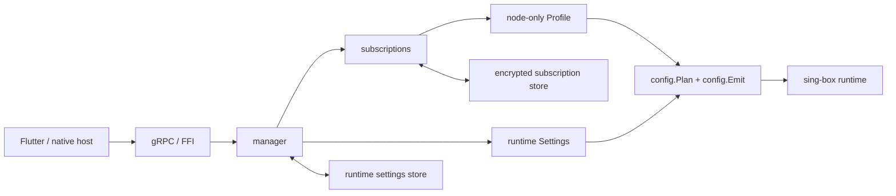
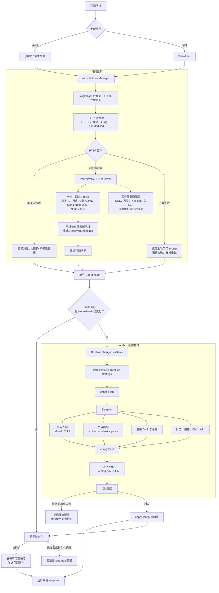

# TargetLib 架构

TargetLib 将订阅管理、配置生成和 sing-box 生命周期封装在共享的 Go 核心中。Flutter、FFI 和 gRPC 只负责调用，
不承担订阅下载、解析或运行时配置决策。

## 模块职责

| 模块 | 职责 |
| --- | --- |
| `api/TargetLib` | gRPC 协议与传输模型 |
| `subscriptions` | 订阅更新、调度、存储、事件和端点解析 |
| `profile` | 节点中间态与 sing-box 节点解析 |
| `config` | `Profile + Settings` 到 sing-box 配置的唯一生成路径 |
| `manager` | 配置协调、服务生命周期、状态、日志和流量 |
| `ffi/native`、`flutter` | 平台接入与客户端绑定 |



## 核心边界

- 前端只发送添加、删除、更新、选择和启停等粗粒度命令。
- 原始订阅配置只作为解析输入，运行时只消费节点中间态 `profile.Profile`。
- `profile` 在持久化前统一规范化供应商节点；供应商 ALPN 和已移除的 TLS 字段不会进入节点中间态。
- 服务商提供的 DNS、路由、rule set、入站、selector/urltest 分组和运行时选项不会透传。
- `config.Build(settings, profile)` 是最终 sing-box 配置的唯一生成入口。
- `config.Emit` 只序列化 Blueprint 并校验结果，不再解析和重写完整 JSON 文档。
- TUN、系统密钥、私有存储路径和 socket protect 等平台能力由宿主实现。

配置生成分为一次规划和一次输出：

```text
Profile + Settings -> config.Plan -> Blueprint -> config.Emit -> sing-box JSON
```

## 订阅到 sing-box



## 中间态规范化与恢复

`profile.Parse` 在生成 `Node.OutboundJSON` 和类型化 `Node.Outbound` 之前执行节点规范化。供应商指定的 ALPN、
已移除的 ECH 字段和过期的 uTLS 指纹在这一边界被处理，因此持久化表示与运行时表示保持同一不变量。

Badger 中的历史节点在加载时也通过 `profile.RestoreNodeOutbound` 执行相同规范化。若历史内容发生变化，内存中的
`OutboundJSON` 和 `NodesHash` 会同步刷新，避免重启后旧 ALPN 回流。完成上述处理后，`config.Emit` 无需构造
`map[string]any` 遍历整份配置，其固定流程为一次 `MarshalContext` 和一次最终 `validateConfig`。

## 一致性与失败处理

订阅更新由单写协调器串行提交。同一订阅的并发更新会被合并；下载或解析失败时保留上次可用节点并延迟重试。

活动订阅变化时，协调器先生成并加载新运行时配置，再原子持久化订阅状态。运行时加载失败不会提交候选状态；
加载成功后若持久化失败，则恢复旧运行时配置。快照成功提交后才向客户端发布更新事件。
