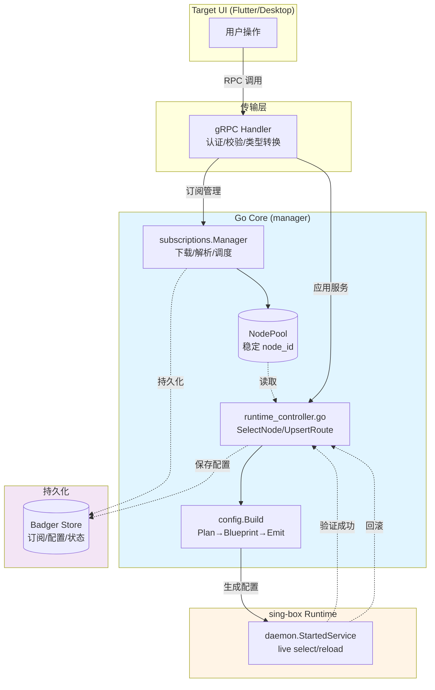
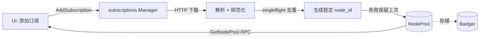
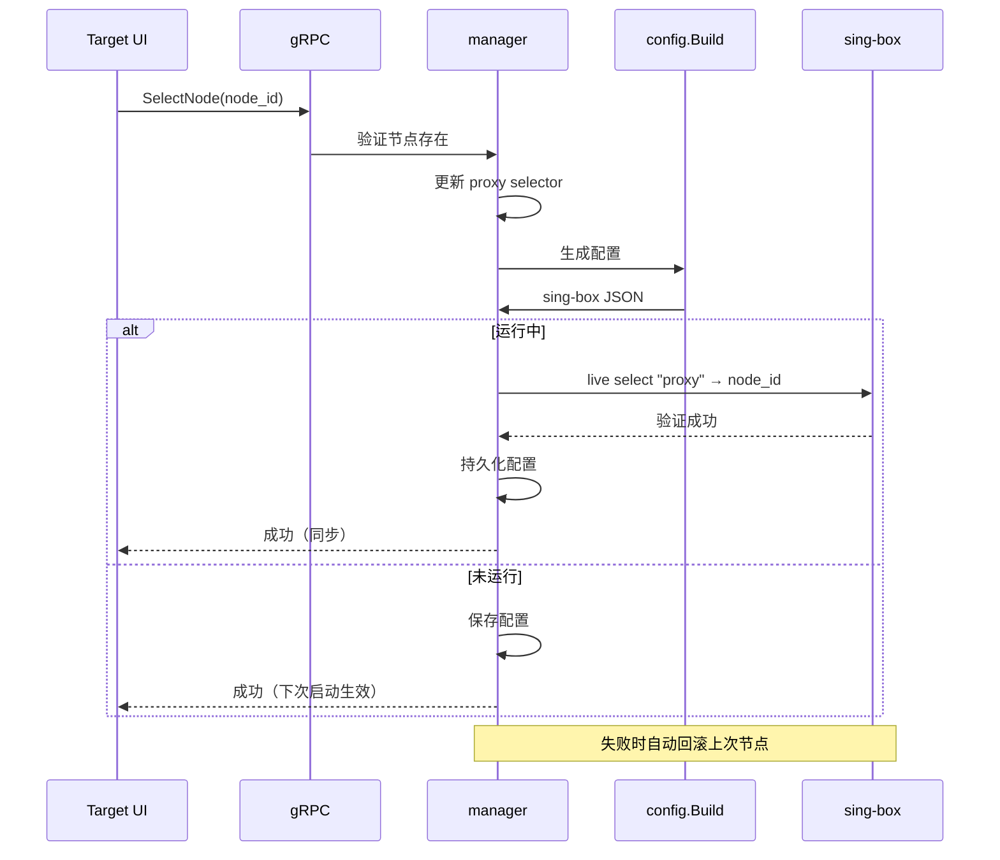
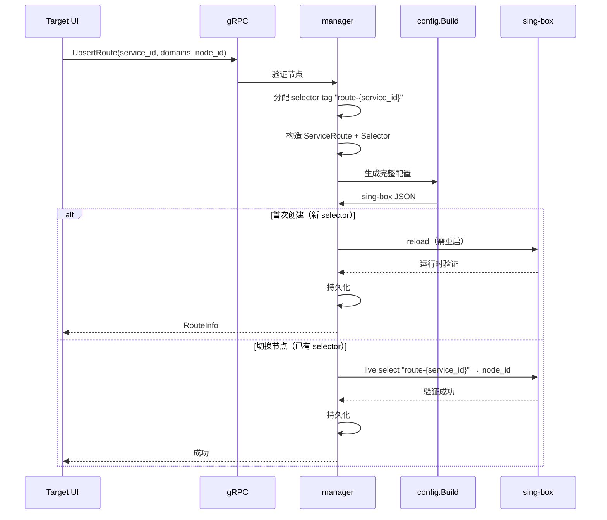
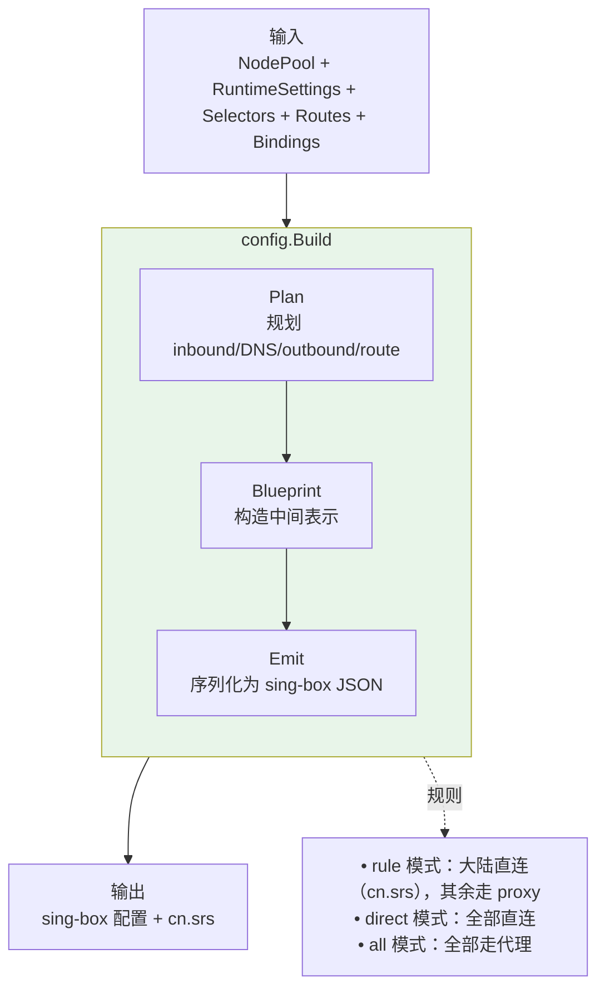

# TargetLib 架构设计

TargetLib 是跨平台 sing-box 管理库，为图形化代理客户端提供核心能力。共享 Go 核心封装订阅管理、节点切换、配置生成和 sing-box 生命周期，gRPC 提供简单同步的控制接口。

## 文档索引

| 文档 | 内容 |
| --- | --- |
| 本文 | 系统架构、数据流、核心边界 |
| [GRPC.md](GRPC.md) | gRPC 接口设计、RPC 分组、使用场景 |
| [GRPC_V2_DESIGN.md](GRPC_V2_DESIGN.md) | 新接口设计理念（参考文档）|

---

## 系统全景

```mermaid
flowchart TB
    subgraph UI["Target UI (Flutter/Desktop)"]
        USER[用户操作]
    end
    
    subgraph TRANSPORT["传输层"]
        GRPC[gRPC Handler<br/>认证/校验/类型转换]
    end
    
    subgraph CORE["Go Core (manager)"]
        direction TB
        SUBM[subscriptions.Manager<br/>下载/解析/调度]
        CTRL[runtime_controller.go<br/>SelectNode/UpsertRoute]
        BUILD[config.Build<br/>Plan→Blueprint→Emit]
        
        SUBM --> POOL[(NodePool<br/>稳定 node_id)]
        CTRL --> BUILD
        POOL -.读取.-> CTRL
    end
    
    subgraph PERSIST["持久化"]
        BADGER[(Badger Store<br/>订阅/配置/状态)]
    end
    
    subgraph RUNTIME["sing-box Runtime"]
        BOX[daemon.StartedService<br/>live select/reload]
    end
    
    USER -->|RPC 调用| GRPC
    GRPC -->|应用服务| CTRL
    GRPC -->|订阅管理| SUBM
    SUBM -.持久化.-> BADGER
    CTRL -.保存配置.-> BADGER
    BUILD -->|生成配置| BOX
    BOX -.验证成功.-> CTRL
    BOX -.回滚.-> CTRL
    
    style CORE fill:#e1f5ff
    style RUNTIME fill:#fff4e6
    style PERSIST fill:#f3e5f5
```

**依赖方向**：只能从外层指向内层。gRPC handler 不承担业务逻辑，manager 不依赖 Flutter/Activity 存活，config.Build 只消费规范化模型。

---

## 核心数据流

### 订阅 → 节点池

```mermaid
flowchart LR
    UI[UI: 添加订阅] -->|AddSubscription| SUB[subscriptions.Manager]
    SUB -->|HTTP 下载| FETCH[解析 + 规范化]
    FETCH -->|singleflight 去重| PARSE[生成稳定 node_id]
    PARSE -->|失败保留上次| POOL[(NodePool)]
    POOL -.存储.-> STORE[(Badger)]
    POOL -->|GetNodePool RPC| UI
```

**关键点**：
- 原始订阅只作解析输入，供应商的 DNS/路由/rule set 不透传
- `node_id` 基于订阅 ID + 节点特征生成，订阅更新后保持稳定
- 失败时保留上次可用节点池，新订阅失败则回滚

### 节点切换（Layer 1）

```mermaid
sequenceDiagram
    participant UI as Target UI
    participant RPC as gRPC
    participant M as manager
    participant C as config.Build
    participant B as sing-box

    UI->>RPC: SelectNode(node_id)
    RPC->>M: 验证节点存在
    M->>M: 更新 proxy selector
    M->>C: 生成配置
    C->>M: sing-box JSON
    
    alt 运行中
        M->>B: live select "proxy" → node_id
        B-->>M: 验证成功
        M->>M: 持久化配置
        M-->>UI: 成功（同步）
    else 未运行
        M->>M: 保存配置
        M-->>UI: 成功（下次启动生效）
    end
    
    Note over M,B: 失败时自动回滚上次节点
```

### 规则分流（Layer 2）

```mermaid
sequenceDiagram
    participant UI as Target UI
    participant RPC as gRPC
    participant M as manager
    participant C as config.Build
    participant B as sing-box

    UI->>RPC: UpsertRoute(service_id, domains, node_id)
    RPC->>M: 验证节点
    M->>M: 分配 selector tag "route-{service_id}"
    M->>M: 构造 ServiceRoute + Selector
    M->>C: 生成完整配置
    C->>M: sing-box JSON
    
    alt 首次创建（新 selector）
        M->>B: reload（需重启）
        B-->>M: 运行时验证
        M->>M: 持久化
        M-->>UI: RouteInfo
    else 切换节点（已有 selector）
        M->>B: live select "route-{service_id}" → node_id
        B-->>M: 验证成功
        M->>M: 持久化
        M-->>UI: 成功
    end
```

---

## 配置生成流程

```mermaid
flowchart TB
    INPUT["输入<br/>NodePool + RuntimeSettings + Selectors + Routes + Bindings"]
    
    subgraph BUILD["config.Build"]
        direction TB
        PLAN[Plan<br/>规划 inbound/DNS/outbound/route]
        BLUE[Blueprint<br/>构造中间表示]
        EMIT[Emit<br/>序列化为 sing-box JSON]
        
        PLAN --> BLUE
        BLUE --> EMIT
    end
    
    OUTPUT["输出<br/>sing-box 配置 + cn.srs"]
    
    INPUT --> BUILD
    BUILD --> OUTPUT
    
    NOTE1["• rule 模式：大陆直连（cn.srs），其余走 proxy<br/>• direct 模式：全部直连<br/>• all 模式：全部走代理"]
    
    BUILD -.规则.-> NOTE1
    
    style BUILD fill:#e8f5e9
```

**config.Build 职责**：
- **唯一入口**：所有 sing-box 配置生成必须经过此函数
- **不透传供应商配置**：订阅的 DNS/路由/rule set/入站/代理组不进入运行时
- **确定性**：相同输入产生相同输出，无隐式状态

---

## 失败处理与一致性

| 失败点 | 核心行为 | 客户端体验 |
| --- | --- | --- |
| 订阅下载/解析失败 | 保留上次可用节点池，按策略退避重试 | 订阅状态显示 failed；现有节点仍可切换 |
| 节点不在池中 | 拒绝切换请求 | SelectNode 返回 `NOT_FOUND` |
| live select 失败 | 保持旧节点不变 | 返回错误，UI 显示切换失败 |
| reload 失败 | 重载上次可用配置 | 返回错误，运行时恢复到上次状态 |
| 配置保存失败 | 运行时回滚，不发布事件 | 返回错误，配置未改变 |
| 客户端断开 | 核心继续运行，不影响代理 | 重连后调用 GetProxyStatus 恢复 UI |
| sing-box 崩溃 | 平台重启 service，恢复上次配置 | 状态变为 failed，显示错误信息 |

**核心原则**：
- **同步 RPC 失败 = 无副作用**：SelectNode 失败时，节点选择不变
- **异步故障不传播**：订阅更新失败不影响当前代理运行
- **回滚优于降级**：配置应用失败时恢复 last-known-good
- **客户端无状态**：UI 断开重连后通过 GetProxyStatus/ListRoutes 恢复，无需额外同步

---

## 平台部署

| 平台 | 运行方式 | 通信方式 | 关键恢复要求 |
| --- | --- | --- | --- |
| Windows | 系统服务 | TCP 127.0.0.1:19090 | 服务启动时恢复配置和状态 |
| Linux | systemd service | TCP / Unix socket | systemd 重启后恢复 |
| macOS | launchd / 独立进程 | TCP / Unix socket | launchd 恢复与网络变化回调 |
| Android | 前台 VpnService（独立进程）| 进程内通信 | START_STICKY 空 Intent、TUN 重建、Flutter 脱离后继续 |
| iOS | Network Extension | 受限 IPC | extension 生命周期内恢复 |

### Android 特殊要求

- **独立进程**：`:targetlib` 前台 VpnService 独立于 Flutter Activity
- **生命周期**：Activity 销毁不影响代理运行
- **恢复**：`START_STICKY` 确保系统杀死后自动重启
- **通信**：Flutter 通过本地 socket 连接核心（非跨进程）

---

## 架构优化建议

### 当前流程存在的优化空间

**1. 配置生成与验证可前置**
- 现状：`SelectNode` → 构造 selector → `prepareRuntimeContent` → 运行时应用
- 问题：配置生成和验证发生在持锁期间，阻塞其他操作
- 优化：验证节点可用性后立即释放锁，异步生成配置并应用

**2. live select 验证冗余**
- 现状：调用 `daemon.SelectOutbound` 后，通过 `SubscribeGroups` 读回验证
- 问题：需要订阅流并等待下一次状态推送
- 优化：sing-box 的 selector API 同步返回错误，可直接判断成功/失败

**3. 节点池与配置生成耦合**
- 现状：每次切换都要遍历完整节点池生成配置
- 问题：订阅有 1000+ 节点时，只切换 1 个节点却要序列化全部
- 优化：使用增量更新或配置模板，只替换变化的 selector

**4. Store 写入在关键路径**
- 现状：live select 成功后立即 `SaveSnapshot`，失败则回滚
- 问题：存储慢会阻塞 RPC 返回，用户体验差
- 优化：先返回成功，异步持久化，失败时记录日志并重试

**5. 规则分流首次创建代价高**
- 现状：`UpsertRoute` 创建新规则时必须 reload（因为新增 selector）
- 问题：reload 会短暂断开连接
- 优化：预创建常用服务的 selector（如 `route-netflix`），只修改其 members

### 推荐优化优先级

**P0（立即）**：
- 缩小 `opMu` 锁粒度：配置生成移出临界区
- 移除 live select 的流式验证：依赖 API 返回值

**P1（短期）**：
- 增量配置更新：selector 变更不重新序列化所有节点
- 异步持久化：live select 成功后先返回，后台保存

**P2（长期）**：
- 配置模板机制：预留 selector slots，避免 reload
- 节点池分片：大订阅场景下按区域/类型分组

---

## 核心边界与约束

- **gRPC 只是传输层**：不承担运行时策略、评分、探测调度
- **selector/route/binding 构造由核心独占**：客户端只提供 `node_id` 和 `domains`
- **原始订阅只作解析输入**：供应商的运行时选项不透传
- **config.Build 是唯一入口**：所有 sing-box 配置生成必须经过此函数
- **TUN/密钥/存储路径由宿主实现**：平台能力通过回调注入
- **Flutter UI 只提交意图并渲染 snapshot**：不实现评分、探测调度或构造完整 RuntimeModel
- **Android 长期任务由前台 VPN service 执行**：不依赖 Activity/Flutter engine 存活
