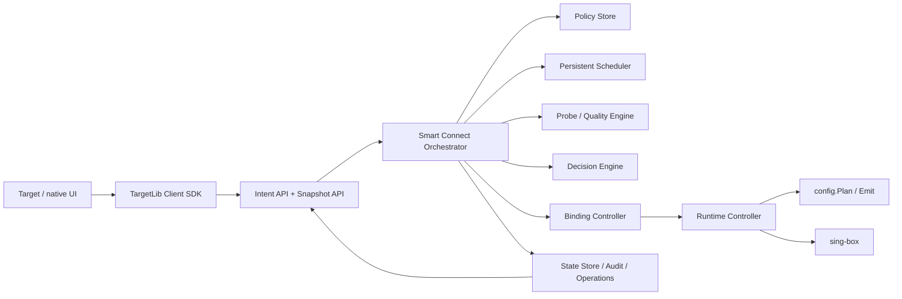

# Smart Connect 目标架构

## 文档状态

本文定义 Smart Connect 的目标架构和迁移边界。当前协议版本 13 已将服务策略、持久化任务、候选评估、proposal、
operation、授权绑定、验证和回滚迁入共享 Go 核心；v12 低层接口仅为兼容和诊断保留。

目标状态下，TargetLib 是 Smart Connect 唯一事实源和长期运行者。Target、其他 Flutter 客户端及平台 UI
只提交用户意图、显示快照和确认需要人工授权的切换，不再构造 selector、路由、绑定或评分结果。

## 与总架构和协议的关系

本文只定义 Smart Connect bounded context。系统分层、平台部署、启动恢复和跨模块失败处理以
[TargetLib 架构](DESIGN.md) 为准；当前与目标 RPC、幂等、错误码和兼容策略以 [gRPC 能力总览](GRPC.md) 为准。

| 本文概念 | 总架构组件 | 协议投影 |
| --- | --- | --- |
| `ServicePolicy` / `SwitchPolicy` | PolicyService + State Store | policy query/upsert/delete |
| persistent task | Scheduler | evaluation operation 和 snapshot deadline |
| `Evaluation` | ProbeEngine + DecisionEngine | operation result / diagnostics |
| `SwitchProposal` | Orchestrator + State Store | snapshot proposal + approve/reject command |
| `Binding` | BindingController | snapshot binding + force/approve command |
| live select / reload | RuntimeController | 不直接暴露配置拼装；通过 operation 状态观察 |
| audit / event | EventJournal | operation query + cursor event stream |

领域模型不得直接使用生成的 protobuf 类型持久化。handler 将 wire message 转为领域 command；QueryService 再将领域 snapshot
投影为协议响应。这样协议升级不会迫使 Store 与内部状态机同步破坏性迁移。

## 架构目标

- TargetLib 独立管理服务策略、节点偏好、质量数据、绑定、调度任务和审计记录。
- Flutter isolate 暂停、Activity 被销毁或客户端断开后，评估和已授权的自动切换仍可继续。
- 每个服务的评估和切换严格串行，任何结果都绑定不可变 revision，避免旧结果覆盖新状态。
- 首次创建路由允许配置重载；后续节点切换优先使用 live selector，减少连接中断。
- 自动切换必须由显式策略授权，并受地区、订阅、驻留时间、冷却期和频率限制。
- 切换完成必须验证实际 selector 和服务健康；失败时恢复上一个已知良好绑定。
- 所有客户端均消费同一领域模型和决策结果，不在 Dart、Kotlin、Swift 或 UI 中复制策略算法。

## 职责边界

| 组件 | 负责 | 不负责 |
| --- | --- | --- |
| Target / UI | 编辑用户意图、发起命令、审批 proposal、显示 snapshot 和 operation | 评分、探测编排、定时器、selector/route/binding 构造、Smart Connect 持久化 |
| Flutter SDK / gRPC | 类型安全传输、重连、快照和事件订阅 | 领域决策、重试策略、运行时配置拼装 |
| 平台宿主 | VPN 权限、TUN、socket protect、前台服务、系统密钥和网络变化通知 | 服务选择和配置决策 |
| Smart Connect Orchestrator | 策略、调度、评估、proposal、授权、切换状态机和审计 | 直接生成任意供应商配置 |
| config / RuntimeController | 规范化模型、生成配置、live select、reload、验证和回滚 | 用户偏好和评分规则 |
| sing-box | 数据平面、selector 和实际流量转发 | 业务策略和自动故障转移 |



## 核心领域模型

### ServicePolicy

完整策略由 TargetLib 持久化并校验：

- 服务 ID、显示名称和域名后缀；
- 允许地区、首选地区和地区证据要求；
- 允许订阅、排除节点、所需标签和节点偏好；
- 一个或多个服务探测目标及全部通过规则；
- 质量有效期、绑定有效期和重新评估周期；
- `SwitchPolicy`；
- 策略 revision 和 schema version。

策略更新生成新 revision，取消旧排队任务，使旧 evaluation/proposal 失效，并将现有绑定标记为待评估。

### SwitchPolicy

支持以下模式：

- `MANUAL`：核心生成 proposal，必须收到客户端审批才切换。客户端离线时保持原绑定。
- `AUTO_CONSTRAINED`：只在策略明确授权的边界内自动切换。
- `LOCKED`：固定节点，核心只报告不可用，不选择其他节点。
- `DIRECT`：服务明确走 Direct，不参与代理节点评分。

`AUTO_CONSTRAINED` 至少包含：

- 允许自动切换的地区和订阅；
- 是否允许跨地区、跨订阅以及回退 Direct；
- 连续失败阈值、最小分数提升和最低健康分；
- 最短驻留时间、切换冷却期和每小时最大切换次数；
- 是否要求切换后服务验证；
- 验证失败后的回滚策略。

默认模式为 `MANUAL`。没有明确授权时，TargetLib 不得静默改变出口地区、订阅或 Direct 状态。

### Evaluation、SwitchProposal 和 Binding

`Evaluation` 是特定 policy、node pool、probe definition 和 quality revision 的不可变结果。

`SwitchProposal` 保存：

- 当前绑定和建议绑定；
- 所有候选的评分和排除原因；
- 触发原因和授权要求；
- 决策使用的全部 revision；
- 创建、过期和审批时间；
- 是否满足自动切换约束。

`Binding` 同时保存 desired、actual 和 last-known-good 节点，以及选择原因、分数、策略 revision、有效期和验证状态。
运行时 selector 已选择目标节点只代表配置生效，不代表服务健康。

## 编排器

Smart Connect Orchestrator 是进程内长期运行的单写协调器。外部 RPC、订阅事件、网络事件和定时任务
统一转换为领域事件，不能直接修改运行时。

触发源包括：

- 用户请求首次绑定、重新评估、强制绑定或审批 proposal；
- 策略、节点偏好或订阅优先级变化；
- 节点池 revision 变化；
- 质量或绑定到期；
- 连续探测失败或当前节点不可用；
- Android/桌面网络变化；
- TargetLib 重启后的恢复任务。

每个服务由独立串行 actor 处理，同一服务最多存在一个活动 evaluation 或 switch operation。不同服务可受全局并发限制地并行。
同类触发在短窗口内合并；更高 policy revision 会取消或废弃旧任务。

## 持久化调度器

调度器属于 Go 核心，不使用 Dart Timer、Activity、WorkManager 或前端事件流维持正确性。任务至少持久化：

- task ID、service ID、类型和触发原因；
- policy/node-pool revision；
- `next_run_at`、attempt、退避和截止时间；
- operation ID 和幂等键。

进程重启后加载未完成任务：已过期任务立即重新排队，未来任务恢复 deadline。网络不可用时使用有上限的指数退避；
策略删除或 revision 改变时原子取消相关任务。

## 探测与决策

ProbeEngine 继续通过指定节点创建隔离的临时 sing-box 出站。它不依赖主运行时是否启动，也不能修改 selector。
每节点尝试次数、每服务并发和全局并发由核心限制；相同 service/node/probe revision 的请求 singleflight 合并。

决策顺序是硬约束优先、评分其次：

1. 节点存在、可构建、已启用且未排除；
2. 订阅、标签和自动切换授权符合策略；
3. 所有服务探测目标通过；
4. 实际地区证据符合允许地区；
5. 质量、探测和策略 revision 当前有效；
6. 再按成功率、丢包、稳定性、首选地区、延迟和用户偏好排序。

所有客户端必须使用核心返回的候选和解释。Flutter 中现有的过滤、聚合和评分实现仅作为迁移期兼容代码，完成迁移后删除。

## 切换状态机

```text
IDLE
  -> EVALUATING
  -> PROPOSAL_READY
  -> WAITING_APPROVAL | APPLYING
  -> VERIFYING
  -> COMMITTED
                 \-> ROLLING_BACK -> ROLLED_BACK | DEGRADED
```

- `EVALUATING`：获取 revision 快照并完成探测、过滤和评分。
- `PROPOSAL_READY`：持久化 proposal，之后才发布事件。
- `WAITING_APPROVAL`：仅 `MANUAL` 使用；客户端离线不会丢失 proposal。
- `APPLYING`：重新检查全部 revision 和授权约束，执行 live select 或 reload。
- `VERIFYING`：读回实际 selector，并按策略执行切换后服务探测。
- `COMMITTED`：原子保存 binding、last-known-good、operation 和审计记录。
- `ROLLING_BACK`：恢复旧 selector/config；回滚失败进入 `DEGRADED` 并发布高优先级事件。

状态转换和结果必须持久化。RPC 取消只取消等待响应，不能让已经开始的提交停在未知中间态。

## 低中断切换

首次创建服务 selector 或域名路由必须经过完整配置事务。后续切换按以下顺序选择执行方式：

1. 目标节点已属于现有服务 selector：调用 sing-box live `SelectOutbound`。
2. selector 成员、域名或其他配置需要改变：构建、校验并 reload 完整配置。

服务 selector 可以包含策略允许的候选集合，但必须是手动 selector，不能使用 `urltest` 自主选择。
只有 BindingController 可以改变服务 selector 的 selected 节点。

live switch 的提交顺序：

1. 校验 proposal、策略、节点池和当前 binding revision；
2. 保存带 `APPLYING` 状态的 operation；
3. 调用运行时 selector；
4. 读回实际选择；
5. 保存 binding 和运行时快照；
6. 执行可选服务验证；
7. 验证失败时切回 last-known-good；
8. 最后发布 committed/rolled-back 事件。

完整 reload 沿用 `VALIDATING -> BUILDING -> APPLYING -> READY/FAILED`，加载或保存失败恢复旧配置。
现有连接默认不迁移；live switch 只影响新连接。强制关闭旧连接必须是独立、显式的策略选项。

## 状态存储与恢复

TargetLib Store 是以下数据的唯一事实源：

- 服务策略、节点偏好和订阅优先级；
- 探测定义、质量历史和网络环境标识；
- desired/actual/last-known-good binding；
- scheduler tasks、operations、proposals 和审计；
- 已应用运行时 revision 和恢复所需节点快照。

策略、绑定、operation 和任务的关联修改必须在一个存储事务中提交。存储 schema 带版本并提供前向迁移；
不支持新 schema 的旧核心必须拒绝写入，而不是以默认值覆盖。

启动恢复顺序：打开并迁移 Store，恢复策略和运行快照，启动 sing-box，核对 actual selector，恢复任务，最后开放写 RPC。
恢复期间 snapshot 明确报告 `RECOVERING`，不能展示虚假 ready。

## Android 后台架构

Android 上 `TargetlibVpnService` 是运行时所有者，Flutter plugin 只负责权限和启动/停止命令。

目标实现要求：

- VPN service 运行在专用 `:targetlib` 进程，避免 UI/Flutter 进程回收影响核心；
- service 启动 native TargetLib、gRPC server、orchestrator 和 scheduler；
- `START_STICKY` 的空 Intent 重启从 Store 恢复 base path、运行配置和未完成任务；
- `ConnectivityManager.NetworkCallback` 将网络变化传入核心并使网络相关质量失效；
- 前台通知展示真实运行状态，可提供暂停、恢复和打开应用操作；
- 支持系统 Always-on VPN；需要开机恢复时由平台宿主实现受控启动；
- socket protect、TUN fd、私有路径和系统密钥仍由 Android 宿主提供。

Activity 销毁、Flutter engine detach、Dart isolate 暂停或事件订阅断开不得停止 native runtime。
用户在系统设置中“强制停止”应用后，Android 不允许后台继续运行，这属于平台边界。

## 意图级 API

目标产品路径只暴露粗粒度意图，不允许 UI 提交完整 selector/route/binding 模型：

```text
GetSmartConnectSnapshot
SetSmartConnectEnabled
ListServicePolicies
UpsertServicePolicy
DeleteServicePolicy
SetNodePreference
RequestServiceEvaluation
ApproveSwitchProposal
RejectSwitchProposal
ForceServiceBinding
GetOperation / ListOperations
SubscribeSmartConnectEvents
```

所有写命令包含 `expected_revision` 和 `idempotency_key`，立即返回持久化 `Operation`。长时间探测、等待审批、切换和验证
通过 operation 状态观察，不占用长 RPC。Force binding 仍必须经过节点存在性、地区和显式安全约束校验。

当前 `UpdateRuntimeConfig.model`、`PutServiceProbe`、`ProbeService`、`EvaluateService` 和 `ApplyServiceBinding`
在迁移期保留给诊断、兼容客户端和底层测试。Target 完成迁移后不得再用它们编排 Smart Connect。

具体请求字段、operation 语义、错误码、版本协商和兼容期限由 [GRPC.md](GRPC.md) 定义；本文列出的名称只表示领域能力，
不能绕过 BindingController 直接调用 RuntimeController。

## Snapshot、Operation 与事件

Snapshot 是权威状态，事件只是变化通知。客户端首次连接、重连或发现 sequence 间断时必须重新读取 snapshot。

Snapshot 至少包含：

- core lifecycle、Smart Connect enabled 和恢复状态；
- policy/node-pool/runtime revision；
- 每个服务的策略摘要、binding、健康、proposal 和活动 operation；
- actual selector、last-known-good、待评估原因和下一次计划任务；
- 最近一次失败及是否需要用户操作。

Operation 使用稳定 ID，状态为 `QUEUED/RUNNING/WAITING_APPROVAL/SUCCEEDED/FAILED/CANCELLED/ROLLED_BACK`。
近期 operation 和关键事件持久化，以便 UI 被挂起后重新查询。事件流带 epoch 和 cursor；服务重启或日志截断时要求 snapshot resync。

## 安全与隐私

- 订阅凭据、临时请求头和敏感 URL 不进入事件、审计或错误文本。
- 后台探测需要凭据时，策略只保存 `SecretRef`，实际值由平台安全存储提供。
- 自动切换不得扩大策略允许的地区、订阅、标签或 Direct 权限。
- 本地 TCP 控制端必须增加认证；Unix socket 同时依赖文件权限。Android 优先使用应用私有 socket。
- 导出策略默认不包含质量、绑定、设备 secret、订阅 URL 或 operation 历史。

## 不变量

- 客户端断开不能改变决策结果或中止已开始的原子提交。
- 一个服务最多有一个 active binding、一个 active proposal 和一个 active switch operation。
- 没有有效 policy revision 的 evaluation 永远不能应用。
- 配置已保存、selector 已生效和服务健康是三个独立状态。
- 自动模式也不能静默越过地区、订阅或 Direct 授权边界。
- 探测失败、绑定过期和节点消失本身不等于授权切换。
- 切换失败时优先保留或恢复 last-known-good；不得隐式回退到全局 proxy。

## 迁移计划

1. 在 proto 和 Store 中增加完整 policy、switch policy、proposal、operation、snapshot 和 task 模型。
2. 在 TargetLib 实现唯一 DecisionEngine，并与 Flutter 旧算法双跑比较，不先改变运行绑定。
3. 增加 orchestrator、持久化 scheduler 和按服务串行状态机。
4. 实现 live switch 优先、reload fallback、切换后验证和 last-known-good 回滚。
5. 提供意图级 API、可恢复 operation 和 snapshot/event cursor。
6. Android VPN service 独立进程化，补齐网络事件和进程死亡恢复。
7. Target 改为只提交意图和渲染 snapshot，再删除本地策略 Store、评分、探测编排和模型构造。
8. 将完整 RuntimeModel 写接口降级为内部/兼容能力，并完成协议和存储 schema 升级。

迁移阶段与全局模块、协议的对应关系：

| 阶段 | TargetLib 内部 | 协议/SDK | Target |
| --- | --- | --- | --- |
| A：领域落地 | 新模型与 schema，旧运行链不变 | 只读 snapshot 可先加入 | 继续旧流程，双跑校验 |
| B：后台评估 | scheduler、operation、唯一 DecisionEngine | request/get operation | 停止本地评分和探测编排 |
| C：核心切换 | proposal、BindingController、验证/回滚 | approve/reject/force binding | 只提交意图 |
| D：生命周期 | Android 独立进程、恢复、event journal | cursor event stream | UI 可任意挂起和重连 |
| E：收口 | 删除双实现，限制低层 model 写入口 | 标记旧 RPC deprecated | 删除本地 Smart Connect Store |

## 验收标准

- 杀死 Flutter Activity 和 Dart isolate 后，TargetLib 仍能执行到期任务、探测和已授权自动切换。
- 重启 TargetLib 后恢复策略、绑定、last-known-good、未完成 operation 和下一次任务。
- 首次应用可 reload；同 selector 内后续切换使用 live select，活动连接不因完整重载被统一关闭。
- revision 变化、持久化失败、运行时失败和验证失败都有确定回滚结果。
- `MANUAL` 在客户端离线时只保留 proposal；`AUTO_CONSTRAINED` 只在授权边界内运行。
- UI 重连只读取 snapshot 即可恢复完整状态，不依赖重放内存事件。
- Target 代码中不再存在 Smart Connect 评分、候选过滤、探测调度或 RuntimeModel 构造逻辑。
